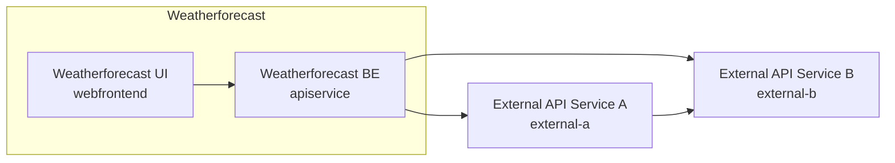

## Base architecture

```mermaid
flowchart LR
subgraph wf[Weatherforecast]
    ui[Weatherforecast UI<br/>webfrontend]
    api[Weatherforecast BE<br/>apiservice]
end
a[External API Service A<br/>external-a]
b[External API Service B<br/>external-b]
ui-->api
api-->a
api-->b
a-->b
```
